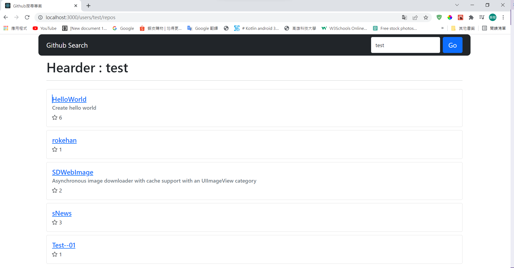

# **GITHUB 搜尋案例 ( Dcard )**

## **啟動服務**

執行語句進入應用程式進入點。
```
$ cd App 
```
啟動服務。
```
$ npm start
```

# **系統架構**

## **頁面**

首先從需求內容開始，我將專案分為三個不同頁面及一個例外頁面。

### **導覽頁**


### **repository 列表**



### **repository 頁面**


### **page 404**


## **目錄架構**
           
    src ___ App ( 應用程式入口 )
        |  
        |__ Components __ ( 一般組件 )
        |                |
        |                |__ Loading ( 一般組件，Loading畫面 )
        |                |
        |                |__ Page1 __ ( 一般組件，repository 列表布局 )
        |                |           |
        |                |           |__ List ( 一般組件，列表組件 )
        |                |
        |                |__ Page2 __ ( 一般組件，repository 頁面布局 )
        |                |           |
        |                |           |__ Detail ( 一般組件，頁面組件 )
        |                |
        |                |__ WrapComps ( 一般組件，主要解決 RRFv6 match props取消問題 )
        | 
        |__ Pages __ ( 路由組件 )
        |            |
        |            |__ Page1 ( repository 列表路由組件入口 )
        |            |
        |            |__ Page2 ( repository 頁面路由組件入口 )
        |            |
        |            |__ Page404 ( 路由無法匹配錯誤導向 )
        |
        |__ Redux __ ( Redux 相關 )
                    |
                    |__ Actions ( 更新 store 相關 action )
                    |
                    |__ Reducers ( 更新 store 相關 reducer )
                    |
                    |__ stateType.js ( 防止工程師在長命名變數的使用下出錯，導出公用 stateType 變數名稱 )
                    |
                    |__ store.js ( store 文件 )
 
 ## **狀態管理**

 首先我在此專案之中的一小部分使用了 redux 進行狀態管理，本來依照需求內容式不需要使用的，原因為組件之間關係並不複雜，並且用多了 redux 可能會有組件多次重複渲染進而造成效能上的問題。</br></br>
 在專案中我將其中一狀態( searchContent )進行 redux 狀態管理以此作為範例，表示我具備使用 redux 的能力及概念。

 ## **狀態管理視圖**

 

 ## **系統運行步驟**

 在此我將會提出四個重要的檔案進行說明。

* [index.js](#index)
* [App / index.jsx ](#app)
* [Pages / Page1 / index.jsx](#page1)
* [Components / Page1 / List / index.jsx](#list)
</br>
</br>

### <a id=index>**index.js ( 主程式進入點 )**</a>

</br>
 系統運行時將由系統入口( index.js )進行 store 狀態訂閱，並且註冊路由接著進入應用程式入口 ( APP -> index.jsx )。
 
```js
class Main extends Component {
  render() {
    return (
      <Router>
        <Routes>
          <Route path="/" element={<App />}></Route>
          <Route exact={true} path="/users/:username/repos" element={<Page1 />}></Route>
          {/* <Route exact={true} path="/users/:username/repos/:repo" element={<Page2 {...this.props}/>}></Route> */}

          <Route exact={true} path="/users/:username/repos/:repo" element={ <WrapComps element={ Page2 } />}></Route>

          {/* 匹配不到路由狀況 */}
          <Route path="*" element={<ErrorPage />}></Route>
        </Routes>
      </Router>
    )
  }
}

ReactDOM.render(
  <React.StrictMode>
    <Main />
  </React.StrictMode>,
  document.getElementById('root')
);

store.subscribe(()=>{
  ReactDOM.render(<Main />, document.getElementById('root'))
})
```
### <a id=app>**App / index.jsx ( 應用程式入口 )：</a>**
</br>
此時( APP -> index.jsx )內，我創建一個 Component 自用 state ( searchContent ) 與 store 內部所用一樣。</br></br>
在這裡的意義是，由於我的 input ( searchContnent value ) 是綁在 change 事件底下的，那麼當 change 一旦觸發就會發起相對的 action 行動進行 dispatch，緊跟著的，當 action 發生並且成功更改 store 里的值時，由於我們在程式入口就 subscribe 了 store 的變化，所以 App 組件將重新 re-render 這將導致使用情況變成我們再更改 input 時 store 也進行更改，這不是我所樂見的。</br></br>
這裡的解決方案是，我先將 input ( searchContent ) 綁在 APP 自身組件底下的 state，當我真的按下了**搜尋**按鈕，我才將 searchContent 提交至 store 進行管理。

```js

  // 狀態保存於該組件內
  state = { searchContent: '' }

  // 路由更變時提交狀態至store管理，改善change事件組件重新re-render問題
  submitEvent = (e) => {
    let searchContent = this.state.searchContent;
    if (searchContent === '') {
      alert('不可輸入空字串')
      e.preventDefault();
      return
    }
    store.dispatch(createSearchContentAction({ 'searchContent': searchContent }))
  }
  changeEvent = (e) => {
    this.setState({ searchContent: e.target.value })
  }

  render() {
    return (
      <Container fluid className="diagonal-gradient" style={{ height: '100vh' }}>
        <div className="index-search-wrap">
          <Row>
            <Col md={12}>
              <h1 className="index-title">Github search react example<br />For the best interview</h1>
              <p className="index-description">For best regard, it's excited for me to do this project with Dcard's team</p>
            </Col>
          </Row>
          <Row>
            <Col md={4}>
              <input onChange={this.changeEvent} className="form-control form-control-lg" size="lg" type="text" placeholder='username....' />
            </Col>
            <Col md={4}>
              <Link role="button" to={`/users/${this.state.searchContent}/repos`} onClick={this.submitEvent}>
                <Button size="lg">Search for github</Button>
              </Link>
            </Col>
          </Row>
        </div>
      </Container>
    )
  }
}

```
</br>

### <a id=page1>**Pages / Page1 / index.jsx ( 路由組件 )**</a>

</br>

### **工作流程 :**


匹配 Page1 路由組件 -> render Page1 組件 -> 判斷是否正在加載數據 -> 呼叫 Loading 組件或是 List 子組件 -> 組件掛載完成( componentDidMount ) -> 取消 Loading 動作並初始化數據，判斷是否可能還需要加載數據( 若是回傳筆數不等於 10 筆，表示根本沒有需要監聽 scroll 事件，因為沒更多數據可以加載了 ) -> 監聽 scroll 事件( 判斷是否滾到最底 )。

### **click 事件觸發 :**
 此時將 searchContent 交給 redux 管理，更新搜索條件，並初始化 state 有關於 GET 的參數( state => response, page )，依照 response 比數判斷是否重新進行 scroll 事件監聽( 監聽事件，到底會自動取消事件以防止多次觸發 )。

 ### **scroll 事件觸發 :**
 **此事件監聽重點在於判斷是否滾動到底並且是否還有數據可以請求**

當條件達成時( 頁面滾到底了並且還有數據可以加載 )，將取消監聽事件以防止監聽事件不斷重複觸發，開啟加載更多組件動畫( 此時我將另開一計時器500毫秒，目的在於使加載動畫至少持續0.5秒，以提升使用者體驗 )，接下來請求原資料往後的 10 筆數據，此時注意，這裡將進行回傳筆數的判斷( 判斷接下來是否還有數據要加載 )。

1. **回傳筆數等於 0** => 表示初始化時就剛好該用戶就是10個repo，所以依此情況將不再進行往後的數據加載( state => isEnd : true )，並且將不重新監聽 scroll 監聽事件。

2. **回傳筆數小於並且不等於 10** => 表示往後已經沒有數據可以請求了，所以將不再進行往後的數據加載( state => isEnd : true )，並且將不重新監聽 scroll 監聽事件。

3. **回傳筆數為 10** => 表示還有可能有數據可以請求了，所以將重新監聽 scroll 事件，並且將繼續判斷是否有更多數據可請求( state => isEnd : false )。

```js
export default class Page1 extends PureComponent {

  /*
    searchContent ( string ) : 搜尋條件
    response ( Object )      : 請求回傳數據
    page ( int )             : 當前頁數索引
    isLoading ( bool )       : 確認是否正在 Loading，用於等待載入頁面數據
    isLoadingMore ( bool )   : 確認是否正在 Loading，用於等待載入更多數據
    isEnd ( bool )           : 確認數據否還需要發出更多的請求
  */
  state = { searchContent: '', response: {}, page: 1, isLoading: true, isLoadingMore: false, isEnd: false }

  //組件掛載後，初始化數據
  componentDidMount() {
    let { searchContent } = store.getState();
    axios.get(`https://api.github.com/users/${searchContent}/repos`,
      {
        params: {
          sort: 'id',
          per_page: 10,
          page: this.state.page
        }
      }
    )
      .then((response) => {
        //初始化資料，並且關閉 loading 畫面
        this.setState({ response: response.data, isLoading: false, searchContent: store.getState().searchContent })
        //判斷是否監聽 scroll 事件，當回傳資料等於 10 筆時，表示可能還有下一頁
        if (Object.keys(response.data).length === 10) {
          window.addEventListener('scroll', this.handleScroll)
        }
      })
      .catch((error) => {
        Swal.mixin({
          toast: true,
          position: 'top-end',
          showConfirmButton: false,
          timer: 3000,
          timerProgressBar: true,
          didOpen: (toast) => {
            toast.addEventListener('mouseenter', Swal.stopTimer)
            toast.addEventListener('mouseleave', Swal.resumeTimer)
          }
        }).fire({
          icon: 'error',
          title: `${error.message}`
        })
        this.setState({  isLoading: false, searchContent: store.getState().searchContent })
      })
  }
  componentWillUnmount(){
    window.removeEventListener('scroll', this.handleScroll, false);
  }

  //綁定輸入資料至 state 管理
  changeEvent = (e) => {
    this.setState({ searchContent: e.target.value })
  }


  clickEvent = (e) => {
    let searchContent = this.state.searchContent;
    if (searchContent === '') {
      alert('不可輸入空字串')
      e.preventDefault();
      return;
    }
    //點擊後將 searchContent 交至 redux 管理
    store.dispatch(createSearchContentAction({ searchContent: searchContent }))
    axios.get(`https://api.github.com/users/${searchContent}/repos`,
      {
        params: {
          sort: 'id',
          per_page: 10,
          page: 1
        }
      }
    )
      .then((response) => {
        //初始化資料
        this.setState({ response: response.data, isLoadingMore: false, isEnd: false, page: 1 })
        //判斷是否監聽 scroll 事件，當回傳資料等於 10 筆時，表示可能還有下一頁
        if (Object.keys(response.data).length === 10) {
          window.addEventListener('scroll', this.handleScroll)
        }
      })
      .catch((error) => {
        Swal.mixin({
          toast: true,
          position: 'top-end',
          showConfirmButton: false,
          timer: 3000,
          timerProgressBar: true,
          didOpen: (toast) => {
            toast.addEventListener('mouseenter', Swal.stopTimer)
            toast.addEventListener('mouseleave', Swal.resumeTimer)
          }
        }).fire({
          icon: 'error',
          title: `${error.message}`
        })
      })
  }

  // 監聽滾動事件
  handleScroll = async (e) => {
    let searchContent = store.getState().searchContent
    let scrollTop = e.target.documentElement.scrollTop
    let scrollHeight = e.target.documentElement.scrollHeight
    let clientHeight = e.target.documentElement.clientHeight
    const isBottom = (scrollTop + clientHeight + 20) > scrollHeight

    //判斷滾動是否到底並且是否還須加載數據
    if (isBottom && !this.state.isEnd) {
      //取消滾動監聽事件，防止多次觸發 function
      window.removeEventListener('scroll', this.handleScroll, false);
      //開啟加載更多動畫
      this.setState({ isLoadingMore: true, page: this.state.page * 1 + 1 })
      //操作dom滾到最底
      window.scrollTo(0, document.body.scrollHeight);

      await axios.get(`https://api.github.com/users/${searchContent}/repos`,
        {
          params: {
            sort: 'id',
            per_page: 10,
            page: this.state.page
          }
        }
      )
        .then((response) => {
          let jsonData = []
          if (Object.keys(response.data).length === 0) {
            this.setState({ isEnd: true, isLoadingMore: false })
          } else if (Object.keys(response.data).length < 10) {
            setTimeout(() => {
              jsonData.push(...this.state.response, ...response.data)
              this.setState({ isEnd: true, isLoadingMore: false, response: jsonData })
            }, 500);
          } else {
            setTimeout(() => {
              jsonData.push(...this.state.response, ...response.data)
              this.setState({ isLoadingMore: false, response: jsonData })
              window.addEventListener('scroll', this.handleScroll)
            }, 500);
          }
        })
        .catch((error) => {
          Swal.mixin({
            toast: true,
            position: 'top-end',
            showConfirmButton: false,
            timer: 3000,
            timerProgressBar: true,
            didOpen: (toast) => {
              toast.addEventListener('mouseenter', Swal.stopTimer)
              toast.addEventListener('mouseleave', Swal.resumeTimer)
            }
          }).fire({
            icon: 'error',
            title: `${error.message}`
          })
        })
    }
  }

  render() {
    return (
      
      <Container >
        <Row>
          <Col md={12}>
            <Navbar bg="dark" variant="dark" expand="lg" style={{ borderRadius: '10px' }}>
              <Container fluid>
                <Navbar.Brand>Github Search</Navbar.Brand>
                <Navbar.Toggle aria-controls="basic-navbar-nav" />
                <Form className="d-flex">
                  <FormControl
                    type="search"
                    placeholder="Search Github"
                    className="me-2"
                    aria-label="Search Github"
                    value={this.state.searchContent}
                    onChange={this.changeEvent}
                  />
                  <Link to={`/users/${store.getState().searchContent}/repos`} onClick={this.clickEvent}>
                    <Button size="lg">Go</Button>
                  </Link>
                </Form>
              </Container>
            </Navbar>
          </Col>
        </Row>

        <Row>
          <Col md={12}>
            {
              (this.state.isLoading) ? <Loading /> : <List response={this.state.response} />
            }
          </Col>
        </Row>
        <Row>
          <Col md={12}>
            {
              (this.state.isLoadingMore) ? <Loading /> : <div></div>
            }
          </Col>
        </Row>
      </Container>
    )
  }
}
```
</br>

### <a id=list>**Components / Page1 / List / index.jsx ( 一般組件 )**</a>
</br>

**作為 Page1 的列表組件，在此只關注傳入參數( props => response )也就是列表資料進行呈現**</br></br>
在這裡要提的一個點是，在此組件( List )我將採用( **PureComponent** )進行，目的在解決**非該組件關注參數**更新時，也就是當父組件更新非( List )子組件關注之狀態( state )時，( List )作為子組件將不進行 render 動作。</br></br>
原理在於在**生命週期**內，當子組件掛載後受到父組件 render 更新狀態而進行重新 render 時，會先經過 **shouldComponentUpdate( )** 函式篩選，若是傳入參數有別於現行子組件狀態時，在進行 render，否則( 傳入參數與現行子組件狀態相同 )將不進行 render，這樣可以簡單解決子組件重複 render 的問題。

```js
export default class List extends PureComponent {

  render() {
    let response = this.props.response
    return (
      <Container >
        <Row style={{ marginTop: '10px' }}>
          <Col md={12}>
            <h1>Hearder : {store.getState().searchContent}</h1>
            <hr />
          </Col>
        </Row>
        {
          Object.keys(response).length === 0 ?
            <div>
              <h3>Search result : 0</h3>
            </div> :
            response.map((item) => {
              return <Row key={item.id}>
                <Col>
                  <Card style={{ width: '100%', marginTop: '10px' }}>
                    <Card.Body>
                      <Card.Title>
                        <Link to={`/users/${item.owner.login}/repos/${item.name}`}>
                          {item.name}
                        </Link>
                      </Card.Title>
                      <Card.Subtitle className="mb-2 text-muted">{item.description}</Card.Subtitle>
                      <Card.Text style={{ display: 'flex', alignItems: 'center' }}>
                        <BsStar style={{ marginRight: '5px' }} />{item.stargazers_count}
                      </Card.Text>
                    </Card.Body>
                  </Card>
                </Col>
              </Row>
            })
        }
      </Container>
    )
  }
}
```


